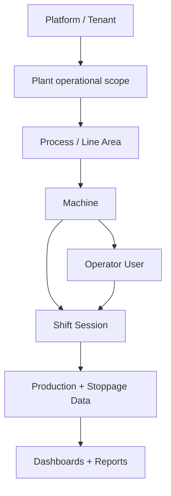
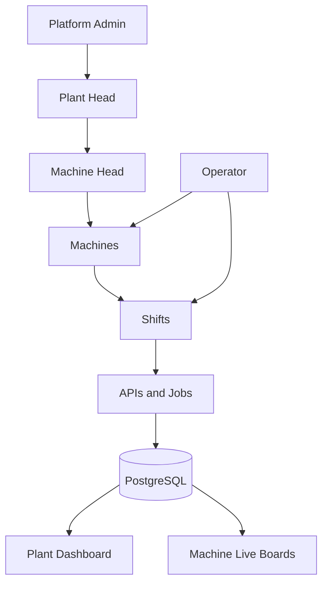

# Admin → Plant → Machine → Operator Architecture Reference

> **Purpose:** Explain how the complete plant-management system works from Admin level down to individual machine/operator level, using **generic industrial terminology** so this architecture can be reused for other industrial plants (including steel).
>
> **Rule of truth:** This document describes **what is actually implemented** in this codebase. Items that are incomplete or absent are marked `PARTIALLY IMPLEMENTED` or `NOT IMPLEMENTED`.
>
> **Codebase:** Zedral M1 MES (manufacturing execution / shop-floor capture platform).  
> **Primary packages:** `packages/client`, `packages/server`, `packages/shared-validation`, `packages/connectors`.  
> **Generated from codebase inspection** (auth, RBAC, admin UI, plant/MH dashboards, DB schema, APIs, jobs). Application code was not modified for this document.

---

## Table of contents

1. [System Overview](#1-system-overview)
2. [Terminology Mapping](#2-terminology-mapping)
3. [Authentication](#3-authentication)
4. [RBAC — Role Based Access Control](#4-rbac--role-based-access-control)
5. [Admin Section](#5-admin-section)
6. [Plant Management](#6-plant-management)
7. [Plant Supervisor](#7-plant-supervisor)
8. [Machine Head / Area Supervisor](#8-machine-head--area-supervisor)
9. [Operator Profile](#9-operator-profile)
10. [Machine Management](#10-machine-management)
11. [Machine-Wise Dashboard](#11-machine-wise-dashboard)
12. [Plant Dashboard](#12-plant-dashboard)
13. [Area / Department Dashboard](#13-area--department-dashboard)
14. [Shift Management](#14-shift-management)
15. [Production Workflow](#15-production-workflow)
16. [Machine Data Flow](#16-machine-data-flow)
17. [Database Relationships](#17-database-relationships)
18. [API Workflow](#18-api-workflow)
19. [Frontend Route Structure](#19-frontend-route-structure)
20. [Backend Architecture](#20-backend-architecture)
21. [Audit and Security](#21-audit-and-security)
22. [Steel Plant Adaptation](#22-steel-plant-adaptation)
23. [Complete User Journey](#23-complete-user-journey)
24. [Permissions and Data Visibility](#24-permissions-and-data-visibility)
25. [Status and State Management](#25-status-and-state-management)
26. [Notifications / Alarms / Events](#26-notifications--alarms--events)
27. [Reporting](#27-reporting)
28. [Implementation Status](#28-implementation-status)
29. [Final Architecture Summary](#29-final-architecture-summary)

---

## 1. System Overview

### What the platform does

The platform is a **Manufacturing Execution System (MES)** focused on:

- Planning import (production schedules / PPC plans)
- Machine and operator assignment
- Shift-based shop-floor capture (operator tablets / APK)
- Process-station queues and order journeys across production lines
- Stoppage (downtime) and defect recording
- Live operational boards
- Plant- and machine-level KPI / OEE reporting
- Export of DPR, line logs, shift summaries, and related reports
- Admin configuration of master data, users, machines, shifts, and validation rules

It is **not** primarily a PLC SCADA / real-time I/O historian. Production and downtime data are predominantly **operator-entered** (with optional external ingest via a canon API). Continuous PLC polling is `NOT IMPLEMENTED` in-repo (connector plugin list is empty).

### Why the platform exists

To give plant leadership and line supervisors a single system to:

1. Plan and assign work to machines
2. Capture what actually ran on each shift
3. Monitor live queues and machine state
4. Review quality / downtime / backlog
5. Export compliance and operational reports
6. Control who can see and change what (RBAC)

### What an industrial plant represents

In this codebase, “plant” is an **operational concept**, not a first-class multi-row plant master table.

| Concept | Implementation |
|--------|----------------|
| Plant as business site | Single deployment / tenant (`security.tenant`, `security.tenant_config`) |
| Plant Head role | `PLANT_HEAD` — plant command center under `/plant` |
| Plant clock / shift windows | Plant timezone helpers (IST) + `master.shift` windows |
| Multi-plant registry | `NOT IMPLEMENTED` — no `master.plant` table |

**Multi-plant support:** `PARTIALLY IMPLEMENTED` via tenancy (`security.tenant`). The product UI assumes one operating plant per deployment. Creating many plants as first-class entities with separate plant dashboards is `NOT IMPLEMENTED`.

### How production areas / sections are organized

Areas are modeled as **processes / lines / DPR areas**, not a hierarchical department tree:

| Layer | Storage | Examples |
|-------|---------|----------|
| Process | `master.process` | HRS, PKL, ANN, RWD, CRS, CTL, rolling/CRM |
| Machine | `master.machine` (`process_code`, optional `department`) | `6HI`, `CRS1`, `CTL-1`, `ANN` |
| DPR area | `master.line_area` (`area_code`) | HRS, CRS_1…CRS_6, CTL_1…CTL_5, PKG, WIP, … |
| Department field | `master.machine.department` | Optional string; **no** dedicated department admin CRUD |

Dedicated “Area / Department management” admin module: `NOT IMPLEMENTED` (beyond machine.department and seeded line areas).

### How machines are represented

Machines live in `master.machine` with codes, process linkage, status (`OPERATIONAL` / `MAINTENANCE` / `OFFLINE`), type, capacity, and CRM capability flags. Specs live in `master.machine_spec`. Registry reads are cached via `MachineRegistryService`.

### How operators are assigned to machines

Three related but distinct concepts exist:

1. **Login user + machine access** — `security.machine_access` (Admin / Plant Head assign which users may operate which machines)
2. **Crew roster names** — `master.machine_crew_roster` (Machine Head maintains named crew roles on a machine; not necessarily login accounts)
3. **Master operators list** — `/master-data/operators` reference data (emp_code / name)

Active floor work is further bound by **shift sessions** (`txn.machine_shift_session`) and optional handover (`txn.machine_handover`).

### How supervisors manage machines / operators

Closest implemented roles:

- **Plant Head** (`PLANT_HEAD`) — plant-wide monitoring, users API, largely read-only on shop-floor mutations
- **Machine Head** (`MACHINE_HEAD`) — line-scoped live boards, assignment, crew, shift review, imports
- **Supervisor** (`SUPERVISOR`) — `PARTIALLY IMPLEMENTED` (see §7); still in app enum/routes; DB migration attempted removal

### How administrators control the overall system

`ADMIN` owns master data, user admin UI, machine master, planning uploads, system shift windows, validation rules, audit, and machine-access assignment UI. Backend `requireRole` always allows `ADMIN`.

### How machine-level data reaches dashboards

```text
Operator tablet / MH desk / import
        ↓
HTTP APIs (/production, /stations, /6hi, /stoppages, …)
        ↓
Postgres (txn.*, planning.*, master.*)
        ↓
Reporting / Live services
        ↓
/reports/* and /live/*
        ↓
Plant Dashboard / Machine Head Live / Line dashboards
```

PLC path is stubbed only (`packages/connectors` with zero plugins). Optional external push: `POST /v1/canon/...` → `canon.*` tables (`PARTIALLY IMPLEMENTED`).

### How users interact with the system

| Channel | Who | Entry |
|---------|-----|--------|
| Web desk | Admin, Plant Head, Machine Head, Quality, Planner, Supervisor | Browser + email/password (SuperTokens) |
| Operator UI / APK | Operator | Badge + PIN; user-scope URLs `/:username.operator/...` |
| Floor device registration | Tablets | `POST /device/register` |

### Hierarchy (as implemented)

```text
Platform (tenant deployment)
  └── Plant (operational site — single-tenant assumption)
       └── Production Process / Line Area (master.process + line_area)
            └── Machine / Equipment (master.machine)
                 └── Machine Profile / Spec (master.machine + machine_spec)
                 └── Operator Assignment (machine_access + crew roster + shift session)
                 └── Shift (master.shift + txn.shift_log + machine_shift_session)
                 └── Production / Process Data (txn.prod_*, orders, ppc_batch, journey)
                 └── Downtime / Stoppages (txn.stoppage, machine_state_event)
                 └── Machine Dashboard (MH live + /reports/machine-head)
                 └── Alarms (NOT IMPLEMENTED as PLC alarms; stoppages used instead)
```



---

## 2. Terminology Mapping

### Generic industrial terms (use these when adapting)

| Generic term | Meaning |
|--------------|---------|
| **Platform Admin** | Full-system administrator: users, master data, machines, system config |
| **Plant Administrator** | Same as Platform Admin in this single-plant deployment; conceptually plant-scoped admin |
| **Plant Supervisor** | Person responsible for plant-wide monitoring and coordination |
| **Area Supervisor / Machine Head** | Person responsible for one or more lines/machines, crew, assignment, shift review |
| **Operator** | Shop-floor user who captures production on assigned machines |
| **Machine** | Physical or logical equipment unit with a stable code |
| **Production Area** | Logical grouping of machines (process / line / DPR area) |
| **Shift** | Time window (A/B/C) and the operational instance for a process/date |
| **Machine Dashboard** | Live / KPI view scoped to one machine or MH-assigned set |
| **Production Order** | Work unit (coil/batch/order) planned or running on a machine |
| **Downtime** | Recorded stoppage with category/code and duration |
| **Alarm** | Automated fault signal from PLC/SCADA — **not implemented** here |
| **Maintenance** | Machine status `MAINTENANCE` and/or maintenance-related stoppages |
| **KPI** | OEE, availability/performance/quality, production vs plan, backlog, defects |

### Current project term → generic industrial term

| Current project term | Generic industrial term |
|----------------------|-------------------------|
| `ADMIN` | Platform Admin |
| `PLANT_HEAD` | Plant Supervisor / Plant Head |
| `MACHINE_HEAD` | Area Supervisor / Machine Head |
| `SUPERVISOR` | Line Supervisor (legacy / partial; often folded into Machine Head) |
| `OPERATOR` | Operator |
| `PLANNER` | Production Planner |
| `QUALITY` | Quality Engineer / Spec Owner |
| Process code (HRS, PKL, ANN, CRS, CTL, RWD, 6HI…) | Production Area / Line |
| `master.line_area` / DPR area | Reporting Area |
| `machine_code` | Equipment ID |
| PPC batch / CRM order / hrs_order / … | Production Order |
| Stoppage | Downtime event |
| Shift log / machine shift session | Shift instance / operator shift login |
| Plant Command Center (`/plant`) | Plant Dashboard |
| Machine Head live boards | Machine / Line Dashboard |
| Journey / queue handoff | Multi-step production route |
| Tenant | Plant deployment / site config |
| Badge + PIN | Operator shop-floor authentication |
| SuperTokens EmailPassword | Staff desk authentication |

Do **not** force steel-specific names into the current product. Map steel mill departments onto **Process / Line Area / Machine** (see §22).

---

## 3. Authentication

### Summary

| Path | Users | Mechanism |
|------|-------|-----------|
| Staff desk login | Admin, Plant Head, Machine Head, Supervisor, Planner, (Quality*) | SuperTokens **EmailPassword** |
| Operator login | Operator (APK / floor) | **Badge (`emp_code`) + 4-digit PIN** → custom API creates SuperTokens session |

\* Quality accounts are in the role enum; automatic SuperTokens EmailPassword provisioning for `QUALITY` in `UserService.isStaffRole` is limited — treat Quality staff login as `PARTIALLY IMPLEMENTED` relative to other desk roles.

**No Passport. No bcrypt.** Operator PINs use Node **scrypt**. Staff passwords are managed by SuperTokens Core.

### Login

**UI:** `packages/client/src/pages/Login.tsx`

1. **Operator:** `POST /auth/badge-pin` with header mode `st-auth-mode: header`
2. **Staff:** SuperTokens `EmailPassword.signIn` via `/auth` recipe APIs

**Server badge login:** `packages/server/src/routes/authRoutes.ts` → `validateBadgePin` (`authService.ts`) → `Session.createNewSession` with claims: `id`, `username`, `roles`, `lineAccess`, `lineScopes`, `machineAccess`.

**Session enrichment:** `packages/server/src/app.ts` overrides `createNewSession` to load live DB grants and **revoke prior sessions** for that SuperTokens user (single active session).

### Logout

`packages/client/src/lib/authStore.ts` → `logout()`:

1. Clear sessionStorage auth keys
2. Reset shift / sixHi client stores
3. `Session.signOut()` when a SuperTokens session exists

### Session / token handling

| Concern | Implementation |
|---------|----------------|
| Transfer method | Header Bearer (`tokenTransferMethod: 'header'`) |
| Client ST config | `packages/client/src/lib/supertokens.ts` |
| Server ST config | `packages/server/src/config/authConfig.ts`, `app.ts` |
| API client | `packages/client/src/lib/apiClient.ts` attaches `Authorization: Bearer <accessToken>` |
| Live grants | `requireAuth` re-hydrates roles/access from DB on each request |

Legacy `sessionStorage.mock_jwt` / `mock_role` keys remain for compatibility but effective role prefers JWT (`sessionRole.ts`).

### Password / PIN mechanism

| Credential | Storage | Rules |
|------------|---------|-------|
| Staff password | SuperTokens | EmailPassword recipe |
| Operator PIN | `security.app_user.pin_hash` | `scrypt$salt$hash`; must be `/^\d{4}$/` |
| Lockout | `pin_locked_until` | Max 5 failures → 15 minutes |
| Dev fallback | When `!AUTH_STRICT` and no hash | PIN `0000` accepted |

Files: `packages/server/src/services/pinService.ts`, `authService.ts`, `config/authConfig.ts`.

### User identity

Stored in `security.app_user`: `user_id`, `username`, `full_name`, `emp_code`, `email`, `pin_hash`, `status`, `supertokens_user_id`, lockout fields.

Statuses: `ACTIVE`, `DISABLED`, `LOCKED` (`UserService`).

### Protected routes (frontend)

| Guard | File | Behavior |
|-------|------|----------|
| `ProtectedRoute` | `components/ProtectedRoute.tsx` | No session → `/login`; idle lock → PIN unlock UI |
| `RoleRoute` | `components/RoleRoute.tsx` | Rank ≥ `minRole` **or** in `allow[]` |
| `PlantRoute` | same | `minRole=MACHINE_HEAD` |
| `MachineHeadRoute` | same | `minRole=MACHINE_HEAD` (+ optional allow) |
| `QualityRoute` | same | `minRole=QUALITY` |
| `AdminRoute` | same | `minRole=ADMIN` |

### Authentication middleware (backend)

| Middleware | File | Behavior |
|------------|------|----------|
| SuperTokens Express middleware | `app.ts` | Parses `/auth` sessions |
| `requireAuth` | `middleware/authMiddleware.ts` | Loads ST session; sets `req.user` from JWT + live DB |
| `requireRole(...)` | same | Allow-list; **ADMIN always passes** |
| `requireLineAccess(level)` | same | Line operation assertion when process present |

Related: `POST /auth/verify-pin` (screen unlock), `POST /auth/supervisor-override` (PIN of Admin / Plant Head / Machine Head — **not** the `SUPERVISOR` role name).

### Frontend authentication state

`packages/client/src/lib/authStore.ts` + `SuperTokensSync` in `App.tsx`:

- Tracks token placeholder, role, line/machine access, lock state
- `hasRole`: ADMIN always true
- `hasLineAccess`: ADMIN / PLANT_HEAD always true; others match grants

### What happens when not authenticated

- Frontend: redirect to `/login`
- Backend: `401 { error: 'Unauthenticated' }`

### What happens when session expires

| Event | Behavior |
|-------|----------|
| API 401 after refresh attempt | Client logout → `/login?session=expired` |
| Login page query | “Session expired. Please sign in again.” |
| Idle ~2 hours | Screen **lock** (PIN unlock), not full logout |
| ST session gone while store has token | `SuperTokensSync` logs out (unless legacy mock JWT) |
| `DISABLED` user | Badge login fails; disabling user revokes ST sessions |

---

## 4. RBAC — Role Based Access Control

### Roles that exist

Canonical enum: `packages/shared-validation/src/types/roles.ts`

| Role | Rank | Typical home (`roleHome.ts`) |
|------|------|------------------------------|
| `OPERATOR` | 0 | `/:userScope` operator workspace |
| `SUPERVISOR` | 0 | `/live` |
| `PLANNER` | 0 | `/planning/import` |
| `MACHINE_HEAD` | 1 | `/machine-head-dashboard` |
| `QUALITY` | 2 | `/quality/specs` |
| `PLANT_HEAD` | 3 | `/plant` |
| `ADMIN` | 4 | `/admin/master-data` |

**Storage:**

- Catalog: `security.role`
- Assignment: `security.user_role` (M:N)
- Line ACL: `security.line_access` (`READ` / `WRITE` / `APPROVE` / …)
- Machine ACL: `security.machine_access` (`READ` / `WRITE` / `MANAGE`)

`pickPrimaryRole()` selects the highest `ROLE_RANK` when multiple roles are present.

> **SUPERVISOR status:** Migration `1913000000000_remove_supervisor_role.js` deletes the DB role row and remaps users to `MACHINE_HEAD`, but the TypeScript enum, UsersAdmin assignability, and many routes still reference `SUPERVISOR`. Treat as **`PARTIALLY IMPLEMENTED` / inconsistent**.

### How permissions are evaluated

1. **Frontend route rank / allow-list** (`RoleRoute`)
2. **Backend `requireRole`**
3. **Line access policy** (`auth/lineAccessPolicy.ts`) — Plant Head mutations largely denied; APPROVE/OVERRIDE allowed
4. **Machine access policy** (`auth/machineAccessPolicy.ts`)
5. **Plan import / PPC policies** (`planImportPolicy.ts`, `ppcAuthorization.ts` — Plant Head PPC denied)
6. **Export authorization** (`export/auth/exportAuthz.ts`)

Plant-wide machine list for `ADMIN` / `PLANT_HEAD` / `SUPERVISOR`: all non-`OFFLINE` machines. Others: rows in `security.machine_access`.

### Permission matrix (from actual code)

Legend: ✅ allowed · ❌ denied · ~ scoped / partial · R read-oriented

| Function | Platform Admin (`ADMIN`) | Plant Head (`PLANT_HEAD`) | Machine Head | Supervisor | Planner | Quality | Operator |
|----------|--------------------------|---------------------------|--------------|------------|---------|---------|----------|
| Manage users (API `/users`) | ✅ | ✅ | ❌ | ❌ | ❌ | ❌ | ❌ |
| Users UI `/admin/users` | ✅ | ❌ | ❌ | ❌ | ❌ | ❌ | ❌ |
| Users UI `/plant/users` | ✅ | ✅ | ~UI open* | ❌ | ❌ | ~UI open* | ❌ |
| Manage roles (assign via user upsert) | ✅ | ✅ | ❌ | ❌ | ❌ | ❌ | ❌ |
| Manage plant entity (CRUD plants) | ❌ N/I | ❌ N/I | ❌ | ❌ | ❌ | ❌ | ❌ |
| Manage machines (master) | ✅ | ❌ | ❌ | ❌ | ❌ | ❌ | ❌ |
| Machine specs / CTL config | ✅ | R (GET) | ✅ | ❌ | ❌ | ❌ | ❌ |
| Assign machine access | ✅ | ✅ | ❌ | ❌ | ❌ | ❌ | ❌ |
| Machine assignment admin page | ✅ | ❌ | ❌ | ❌ | ❌ | ❌ | ❌ |
| Crew roster write | ✅ | ✅ | ✅ | ❌ | ❌ | ❌ | ❌ |
| Live dashboards API | ✅ | ✅ | ✅ | ✅ | ❌ | ❌ | ❌ |
| Plant dashboard `/plant` | ✅ | ✅ | ✅* | ❌‡ | ❌ | ✅* | ❌ |
| MH live / assignment | ✅ | ~ | ✅ | ✅ allow | ❌ | ❌ | ~RWD allow |
| Plan / PPC import | ✅ | ❌ PPC | ✅ commit paths | ✅ some | ✅ import hub | ❌ | ❌ |
| Quality specs write | ✅ | ❌ | ❌ | ❌ | ❌ | ✅ | ❌ |
| Enter operator production data | ✅ | ❌ mutations | ~ | ❌ | ❌ | ❌ | ✅ scoped |
| Shift approve / reject | ✅† | ✅ | ✅ | ❌ | ❌ | ❌ | ❌ |
| View reports / exports | ✅ | ✅ | ✅ | ❌‖ | ❌ | QC_FAILS | ❌ |
| Audit trail read | ✅ | ✅ | ~ | ❌ | ❌ | ❌ | ❌ |
| System shift windows | ✅ | ❌ | ❌ | ❌ | ❌ | ❌ | ❌ |

Notes:

- \* `PlantRoute` requires rank ≥ `MACHINE_HEAD`, so MH/Quality can open the plant shell; some report APIs still require Plant Head / Admin.
- ‡ Supervisor home is `/live`, not `/plant` (rank 0).
- † Admin often included via bypass even when not listed on a specific route.
- ‖ Export role set is Plant Head / Machine Head / Admin (error text may say “supervisor”; code does not include `SUPERVISOR`).
- N/I = not implemented.

### Which role can see which dashboard

| Dashboard | Roles |
|-----------|-------|
| Admin configuration | `ADMIN` |
| Plant Command Center | Rank ≥ `MACHINE_HEAD` (UI); core plant-head report APIs: `PLANT_HEAD`, `MACHINE_HEAD`, `ADMIN` (varies by endpoint) |
| Machine Head live / line boards | `MACHINE_HEAD`, `ADMIN`, often `SUPERVISOR` via `allow` |
| Operator capture workspace | `OPERATOR` (+ authenticated capture routes) |
| Quality specs | `QUALITY`+ |
| Planning import hub | `ADMIN`, `PLANNER` |

---

## 5. Admin Section

**Shell:** `AdminShell` + `AdminNav` + `AdminRail`  
**Nav items (rail):** Master Data, Planning, Users, Audit Trail, System, Validation Rules  
**Also under `/admin` but off-rail:** Machines, Machine Specs, Machine Assignment, ANN Specs

Guard: mostly `AdminRoute` (`minRole=ADMIN`). Machine Specs / ANN Specs use `MachineHeadRoute`.

### 5.1 Master Data — `/admin/master-data`

| # | Detail |
|---|--------|
| Purpose | Maintain reference entities used across capture and reporting |
| Who | `ADMIN` |
| UI | `MasterDataAdmin.tsx` |
| Actions | CRUD for customers, grades, surface finishes, defect codes, stoppage categories/codes, operators, furnaces |
| APIs | `GET/POST/PUT/DELETE /master-data/{entity}` via `adminService` |
| Tables | Corresponding `master.*` entities |
| After action | Lists refresh; entities available to import/capture UIs |

### 5.2 Planning — `/admin/planning`

| # | Detail |
|---|--------|
| Purpose | Upload planning / PPC imports |
| Who | `ADMIN` |
| UI | `PlanningAdmin.tsx` |
| APIs | `POST /api/import`, `/api/6hi/import/ppc`, `GET /import/:batchId`, error-row download |
| Tables | `planning.import_batch`, `planning.ppc_batch`, related journey tables |
| Permissions | Admin UI; PPC commit also used from MH paths with MH/Supervisor roles |

### 5.3 Users — `/admin/users`

| # | Detail |
|---|--------|
| Purpose | Create/update users, roles, line access, machine checkboxes |
| Who | `ADMIN` (Plant Head uses embedded `/plant/users`) |
| UI | `UsersAdmin.tsx` |
| APIs | `GET/POST/PUT /users`, `PUT /users/:id/line-access` |
| Tables | `security.app_user`, `user_role`, `line_access`, `machine_access` |
| Validations | Role enum, status, PIN/email rules for staff |
| After action | Grants affect next `requireAuth` hydration; ST signup for staff roles |

### 5.4 Audit Trail — `/admin/audit`

| # | Detail |
|---|--------|
| Purpose | Query application audit log |
| Who | `ADMIN` (also `/plant/audit`) |
| UI | `AuditTrailView` + `auditService` |
| APIs | `GET /audit?...` |
| Tables | `audit.audit_log` (+ DB triggers `audit.fn_audit`) |

### 5.5 System — `/admin/system`

| # | Detail |
|---|--------|
| Purpose | Health + plant shift window configuration |
| Who | `ADMIN` |
| UI | `SystemAdmin.tsx` |
| APIs | `GET /health`; `GET/PUT /shifts/windows…`; `GET /shifts/audit` |
| Tables | `master.shift`, shift audit tables |

### 5.6 Validation Rules — `/admin/validation-rules`

| # | Detail |
|---|--------|
| Purpose | Configure field validation rules for capture forms |
| Who | `ADMIN` |
| UI | `ValidationRulesAdmin.tsx` |
| APIs | `/validation-rules`, version, `PUT /validation-rules/:fieldId` |

### 5.7 Machines — `/admin/machines` (off-rail)

| # | Detail |
|---|--------|
| Purpose | Machine master CRUD + status |
| Who | `ADMIN` |
| UI | `MachineMasterAdmin.tsx` |
| Fields | code, name, process, type, department, capacity MT, rolling/skin-pass flags, status |
| APIs | `/machines/master`, `/machines/master/:code`, `PATCH .../status` |
| Tables | `master.machine` |
| Statuses | `OPERATIONAL`, `MAINTENANCE`, `OFFLINE` |

### 5.8 Machine Assignment — `/admin/machine-assignment`

| # | Detail |
|---|--------|
| Purpose | Assign which users can access which machines |
| Who | `ADMIN` |
| UI | `MachineAssignmentPage.tsx` |
| APIs | `GET/PUT /machine-access`, `GET /machines/registry` |
| Tables | `security.machine_access` |

### 5.9 Machine Specs / ANN Specs (MH-gated under `/admin`)

| Page | Route | Who | APIs |
|------|-------|-----|------|
| Machine Spec Admin | `/admin/machine-specs` | MH+ | `/machines/specs*`, `/machines/ctl*` |
| ANN Spec Admin | `/admin/ann-specs` | MH+ | `/stations/ann/spec-limits`, `/stations/ann/bases` |

### Admin sections — coverage checklist

| Section | Status |
|---------|--------|
| Dashboard (dedicated admin KPI home) | `NOT IMPLEMENTED` (Admin lands on Master Data) |
| User management | `IMPLEMENTED` |
| Role management (standalone) | `PARTIALLY IMPLEMENTED` (roles assigned on user form; no separate role CRUD UI) |
| Plant management (multi-plant CRUD) | `NOT IMPLEMENTED` |
| Area/department management | `NOT IMPLEMENTED` (seeded areas + machine.department) |
| Machine management | `IMPLEMENTED` |
| Operator management | `PARTIALLY IMPLEMENTED` (users + master operators + crew) |
| Shift management | `IMPLEMENTED` (windows in System; runtime via shift services) |
| Configuration / validation | `IMPLEMENTED` |
| Reports (admin-owned) | `PARTIALLY IMPLEMENTED` (reports live under Plant/MH) |
| Monitoring | `PARTIALLY IMPLEMENTED` (`/health` in System) |
| Audit logs | `IMPLEMENTED` |
| System settings | `IMPLEMENTED` (shift windows + health) |

---

## 6. Plant Management

### Plant creation / profile / identification / status / configuration

| Capability | Status | Reality |
|------------|--------|---------|
| Create multiple plants | `NOT IMPLEMENTED` | No plant master table |
| Plant profile | `PARTIALLY IMPLEMENTED` | Tenant + tenant_config branding/modules |
| Plant identification | Tenant name (e.g. seeded “Hero Steels Limited”) | `security.tenant` |
| Plant status | `NOT IMPLEMENTED` as plant lifecycle | Machines have status instead |
| Plant configuration | `PARTIALLY IMPLEMENTED` | `tenant_config`, module flags `/tenant-flags`, shift windows |
| Plant users | `IMPLEMENTED` | `/plant/users` + `/users` API (PH/Admin) |
| Plant supervisors | `IMPLEMENTED` as role `PLANT_HEAD` | Not a separate plant_supervisor table |
| Plant areas | `PARTIALLY IMPLEMENTED` | Processes + `line_area` seeds |
| Plant machines | `IMPLEMENTED` | `master.machine` |
| Plant-level dashboard | `IMPLEMENTED` | `/plant` → `PlantHeadDashboard` |
| Plant-level KPIs | `IMPLEMENTED` | `/reports/plant-head` |

### Data relationships (as implemented)

```text
Tenant (deployment)
 ↓
Processes / Line Areas
 ↓
Machines
 ↓
Users with machine_access / line_access
 ↓
Shift logs + sessions
 ↓
Production orders / capture / stoppages
 ↓
Plant + MH dashboards / exports
```

### Multi-plant support

`PARTIALLY IMPLEMENTED` tenancy plumbing; **product is single-plant**. Reusing for multi-site steel groups would require a real plant entity and scoping layer (not present today).

---

## 7. Plant Supervisor

### Mapping

| Generic term | Closest implementation |
|--------------|------------------------|
| Plant Supervisor | **`PLANT_HEAD`** (primary) |
| Line Supervisor | **`SUPERVISOR`** (partial / legacy) |

This section documents **Plant Head** as the plant supervisor, and notes Supervisor separately.

### Plant Head (`PLANT_HEAD`) — implemented

| Topic | Behavior |
|-------|----------|
| Access | Home `/plant`; Plant Command Center shell |
| Scope | Plant-wide machines (non-OFFLINE); plant reports |
| Machines | Monitor via live snapshot merge + plant ops UI |
| Operators / users | Can manage users via `/users` API and `/plant/users` UI |
| Assignments | Can assign machine access (API); Admin has dedicated assignment page |
| Shifts | Can approve/reject shift logs; view shift context |
| Production monitoring | Plant dashboard KPIs, production page, order tracking |
| Downtime | Downtime intelligence page from plant-head report data |
| Alarms / faults | No PLC alarms; stoppages / alerts UI based on operational data |
| Actions | Mostly **monitoring + approve/override**; **denied** on PPC commit and most line WRITE mutations (`denyPlantHeadPpc`, `denyPlantHeadMutation`) |
| Cannot access | Admin-only pages (`/admin/*` AdminRoute); operator capture as primary job |

**Diff vs Admin:** No master machine CRUD rail, no system shift window admin, no validation-rules admin, no `/admin/users` (uses plant users instead).

**Diff vs Operator:** Plant-wide read/KPI; no badge-first floor capture workspace as primary home.

### Supervisor role (`SUPERVISOR`) — `PARTIALLY IMPLEMENTED`

- Home `/live`
- Explicit `allow` on many MH routes (import, assignment, live, traceability)
- Plant-wide machine list in auth loading
- DB role removal migration exists; app still references the role
- Spec: `doc/audit/SUPERVISOR_REMOVAL_SPEC.md`

---

## 8. Machine Head / Area Supervisor

### Mapping

**Generic:** Area Supervisor / Machine Head  
**Implemented role:** `MACHINE_HEAD`

```text
Plant Administrator (ADMIN)
        ↓
Plant Supervisor (PLANT_HEAD)
        ↓
Area Supervisor / Machine Head (MACHINE_HEAD)
        ↓
Machine
        ↓
Operator
```

### Responsibility

- Own assigned machines (from `security.machine_access`; Admin/PH have all)
- Live monitoring per line capability (`mhLineCapabilities.ts`)
- Order assignment boards (CRM / CRS / CTL)
- Crew roster
- Shift review
- Line imports / specs where capability allows
- Exports / traceability (scoped)

### Assigned machines / operators / shift

| Concern | Implementation |
|---------|----------------|
| Assigned machines | `machine_access` (+ capability-driven nav) |
| Assigned operators | See users with access; maintain **crew roster** names |
| Shift responsibility | Shift review page; approve path shared with Plant Head |
| Monitoring | Line live dashboards (HRS/PKL/ANN/RWD/CRM), `/live`, `/reports/machine-head` |
| Downtime | Stoppages on stations + downtime pareto on MH report |
| Alarms | `NOT IMPLEMENTED` (use stoppages) |
| Escalation | Supervisor-override PIN mechanism (MH/PH/Admin PIN) — not automated escalation workflow |
| Restrictions | Cannot open AdminRoute pages; cannot manage all users unless also PH |

### Capability-driven nav (examples)

From `packages/client/src/lib/mhLineCapabilities.ts`:

| Line family | Example codes | Typical nav |
|-------------|---------------|-------------|
| HRS / PKL | `HRS`, `PKL` | live, crew, shift-review, import, export, traceability |
| ANN | `ANN` | live, batching, report, import, specs |
| RWD | `RWD` | live, order-assignment |
| CRS / CTL | `CRS*`, `CTL*` | live, assignment, machine-specs |
| CRM mills | `6HI`, `4HI`, `2HI` | live, order-assignment, import |

Files: `MachineHeadNav.tsx`, `MachineHeadShell.tsx`, pages under `pages/machinehead/`.

---

## 9. Operator Profile

### What an “operator” is in this system

| Layer | Meaning |
|-------|---------|
| Login role `OPERATOR` | Authenticated shop-floor user |
| `security.app_user` | Identity: username, emp_code, PIN, status |
| Machine access | Which machines they may use |
| Line access | Process-level ACL |
| Master `operators` entity | Reference list (not always the same as login users) |
| Crew roster entry | Display name/role on a machine for a shift culture |
| Active session | `txn.machine_shift_session` |

### Profile attributes (implemented)

| Attribute | Source |
|-----------|--------|
| Operator identity | `app_user.username`, `full_name` |
| Employee / badge ID | `app_user.emp_code` |
| Assigned plant | Implicit tenant (no plant FK) |
| Assigned area | Via `line_access` / machine process |
| Assigned machine(s) | `machine_access` (many machines possible) |
| Role | `user_role` → `OPERATOR` |
| Shift | Detected session / clock / override (`ShiftDetectionService`) |
| Status | `ACTIVE` / `DISABLED` / `LOCKED` |
| Permissions | Role + line + machine policies |
| Current assignment | Active shift session + queue work |
| Historical assignments | Sessions, handovers, production rows (queryable; no dedicated “history profile” page) |
| Production responsibility | Capture on `/production` and `/stations` for allowed machines |
| Machine access | Enforced server-side |

### Assignment flow

```text
Admin / Plant Head creates user (OPERATOR)
   ↓
Assign roles + machine_access (+ optional line_access)
   ↓
Operator logs in (badge + PIN)
   ↓
Lands on user-scope home / primary machine path
   ↓
Shift detection binds session to shift_log
   ↓
Operator works queue / capture / stoppage screens
```

### Cardinality

| Question | Answer from code |
|----------|------------------|
| One operator → multiple machines? | **Yes** — multiple `machine_access` rows |
| Multiple operators → one machine? | **Yes** — many users can be granted the same machine; concurrent control is via sessions/orders, not exclusive lock table |
| Crew roster vs login | Roster can list names independently of login users |

---

## 10. Machine Management

### Machine master fields (implemented)

From `MachineMasterAdmin` / `MachineMasterService` / migrations:

| Field | Present |
|-------|---------|
| Machine name | ✅ |
| Machine code / ID | ✅ (`machine_code` PK) |
| Plant | ❌ (implicit tenant) |
| Area / process | ✅ `process_code` / process_id |
| Department | ✅ optional string |
| Machine type | ✅ e.g. `CRM_COMBO`, `PLANT`, … |
| Status | ✅ `OPERATIONAL` / `MAINTENANCE` / `OFFLINE` |
| Capacity MT | ✅ |
| Supports rolling / skin pass | ✅ (CRM) |
| PLC / device connectivity | ❌ not on machine master |
| Assigned supervisor | ❌ no FK; implied by MH machine_access |
| Assigned operator | ❌ via access + live session, not a single FK |
| Shift | ❌ not stored on machine row |
| Production / process parameters | ✅ via `machine_spec` (+ line-specific station config) |
| Alarm information | ❌ |
| Maintenance information | ✅ as status `MAINTENANCE` only (no CMMS module) |

### Specs

`MachineSpecService` — versioned drafts/activate for CRS/CTL-style parameters (width/thickness/length, CTL params, etc.).

### CTL hyphen lines

Admin/MH can create/rename/deactivate CTL lines via `/machines/ctl*` (soft OFFLINE if no active PPC).

### Registry

`GET /machines/registry` — machines + CRM sub-process capabilities for UIs.

---

## 11. Machine-Wise Dashboard

### What exists

There is **no single generic “machine SCADA page”** with PLC tags. Implemented dashboards:

1. **Live plant/machine board** — `GET /live/snapshot`, `/live/orders` → `LiveDashboard` / MH live entry
2. **Line-specific MH live pages** — HRS, PKL, ANN, RWD, etc.
3. **Machine Head OEE report** — `GET /reports/machine-head`

### Live machine card fields (implemented)

From `LiveSnapshot` / `MachineStatusCard` / `LiveKpis` (`shared-validation` `types/live.ts`):

| UI concept | Present |
|------------|---------|
| Machine identity | ✅ code, name |
| Current status | ✅ live state (RUNNING / IDLE / STOPPAGE / … via cards) |
| Current order / coil | ✅ |
| Current operator | ✅ |
| State since timestamp | ✅ |
| Active stoppage reason | ✅ |
| Operator remarks | ✅ |
| KPIs: running/idle/breakdown counts | ✅ |
| Active orders / queued MT | ✅ |
| Shift target vs production MT | ✅ |
| Shift performance % | ✅ |
| Production today MT | ✅ |
| Speed / power / PLC health | ❌ `NOT IMPLEMENTED` |
| Continuous process/quality from PLC | ❌ (operator/quality forms instead) |
| Historical trends (generic) | `PARTIALLY IMPLEMENTED` (ANN trends pages; plant OEE trends) |
| Machine health / vibration | ❌ |

### Metric lineage example (live KPIs)

```text
UI Field: shiftProductionMt / runningMachines
→ API: GET /live/snapshot
→ Backend: liveRoutes + live services aggregating sessions, orders, stoppages, state events
→ Database: txn.machine_shift_session, orders, txn.stoppage, txn.machine_state_event, planning.ppc_batch
→ Calculation: ProductionMetricsService / live aggregators
→ Display: Live dashboard / Plant ops merge
```

### Machine Head report metrics

`GET /reports/machine-head` (`ReportingService`):

- `lineStatuses` (RUNNING vs STOPPED from draft shift logs + open stoppages)
- `pendingReviewCount`
- `lineOee` (availability/performance/quality ~30d)
- `downtimePareto`
- `yieldPct`, `rejectionRatePct`

### Data path (actual)

```text
Operator / MH actions (not PLC polling)
      ↓
HTTP capture & station APIs
      ↓
Postgres
      ↓
Live + Reporting services
      ↓
Machine / Line dashboards
```

---

## 12. Plant Dashboard

**Route:** `/plant` → `PlantHeadDashboard.tsx`  
**Shell:** `UnifiedShell` (“Plant Command Center”)

### Implemented aggregates

From `/reports/plant-head` + live merge:

| Metric | Status |
|--------|--------|
| Backlog count | ✅ |
| Plant-wide OEE + target + trend | ✅ |
| Production vs plan (by line) | ✅ |
| Quality trend / top defects | ✅ |
| Downtime drivers | ✅ |
| Daily production target vs actual | ✅ |
| KPI strip: today MT, OEE, A/P/Q + trends | ✅ |
| Live orders / machine detail modals | ✅ |
| Handover overview | ✅ |
| Rejected orders drawer + export | ✅ |
| Total/running/stopped/idle machine counts | ✅ via live KPIs merge (not a separate static plant inventory widget only) |
| PLC alarms | ❌ |

### Calculation model

```text
Machine / shift / stoppage / defect / PPC rows
        ↓
ReportingService.getPlantHeadDashboard(windowDays)
        ↓
Plant KPI strip + charts
        +
Live snapshot poll (useLiveSnapshot)
        ↓
mergePlantHeadWithLive
        ↓
PlantHeadDashboard UI
```

### Related plant pages

| Route | Purpose |
|-------|---------|
| `/plant/live` | Live board |
| `/plant/production` | Production intelligence |
| `/plant/orders` | Order / traceability tracking |
| `/plant/defect-intelligence` | Defects |
| `/plant/downtime-intelligence` | Stoppages |
| `/plant/alerts` | Operational alerts UI (not PLC alarm engine) |
| `/plant/dpr-export`, `/plant/exports/history` | Exports |
| `/plant/audit`, `/plant/users`, `/plant/setup` | Audit, users, device setup |

---

## 13. Area / Department Dashboard

### Representation

| Concept | Implementation |
|---------|----------------|
| Area identity | Process code and/or `line_area.area_code` |
| Machines in area | Machines sharing `process_code` / classification (CRS1–6 under CRS, CTL-n under CTL) |
| Supervisors | Machine Heads with access to those machines |
| Operators | Users with machine_access |
| Dedicated area dashboard page | `NOT IMPLEMENTED` as a first-class `/area/:id` route |
| Closest equivalents | Line MH live dashboards; plant production filtered by line; DPR area exports |

### Data flow

```text
Machines in process
 → station/live/report queries filtered by process or machine set
 → MH line UI or plant charts by lineId
```

There is **no** separate area KPI service beyond process/line filtering inside plant/MH reporting.

---

## 14. Shift Management

### Shift definition

- Table: `master.shift` — codes A/B/C with `start_time` / `end_time`
- Defaults (IST): 06–14 / 14–22 / 22–06 — `packages/shared-validation/src/utils/plantTime.ts`
- Admin editable windows: `/shifts/windows` from System Admin

### Shift instance & assignment

| Entity | Purpose |
|--------|---------|
| `txn.shift_log` | Process + prod_date + shift_code + state + targets/production |
| `txn.machine_shift_session` | Operator session on a machine linked to shift_log |
| `txn.session_crew` | Crew on a session |
| `txn.machine_handover` | Operator-to-operator handover |
| `txn.shift_override_audit` | Manual shift override |

### Current shift detection

`ShiftDetectionService` + `GET /shifts/current`:

1. **SESSION** — ACTIVE `machine_shift_session` within shift end + overtime grace (`SHIFT_OVERTIME_GRACE_HOURS`, default 2h)
2. Else **OVERRIDE** — latest override for user/machine
3. Else **clock** — `resolveShiftFromClock` on `master.shift` windows

`resolveShift()` creates/finds `shift_log` idempotently.

### Production / downtime by shift

- Shift metrics on station APIs and MH shift review
- Reporting windows use plant date + shift attribution (`order_shift_attribution`, shift logs)
- Background: `ShiftBoundaryScheduler` closes stale sessions; optional auto-boundary handover

### Shift reports

- Shift summary export type
- MH `/machine-head/shift-review` (reuses plant shift review page)
- Shift log submit / approve / reject / reopen flows (`/shift-logs`)

---

## 15. Production Workflow

### Generic industrial workflow → implementation

| Step | Implementation |
|------|----------------|
| Production Planning | Admin/Planner/MH import (`/import`, `/6hi/import/ppc`, line imports) |
| Production Order | `planning.ppc_batch`, `txn.*_order`, journey steps |
| Machine Assignment | Order assignment pages + PPC machine fields + CRS/CTL assignment |
| Operator Assignment | `machine_access` + crew + active session |
| Shift Starts | Shift detection + session + shift_log |
| Machine Starts | Operator starts order on station / CRM queue |
| Machine Data Collection | **Operator-entered** capture (`/production`, `/stations`); not PLC |
| Production Data | `txn.prod_*`, CRM rolling/skinpass rows, ANN charges |
| Quality / Process Data | Quality specs module + line quality fields + defects |
| Downtime / Alarm Events | `txn.stoppage` (+ state events); alarms N/I |
| Shift Summary | Shift review + exports |
| Reports | `/reports/*`, `/exports/*` |

### Journey handoff (implemented)

1. Capture writes production + outbox `txn.journey_advance_outbox`
2. `JourneyAdvanceConsumer` advances journey (incl. slit fan-out where applicable)
3. `QueueTransferService` enqueues next step
4. `JourneyHandoffScheduler` drains outbox / reconciles stranded coils

---

## 16. Machine Data Flow

### Actual technical flow

```text
Operator tablet / MH desk / Planner import / (optional) Canon client
        ↓
HTTPS JSON APIs (Express)
        ↓
AuthN (SuperTokens) + AuthZ (roles / line / machine policies)
        ↓
Services (ProcessStation, Production, PPCImport, Live, Reporting, …)
        ↓
Validation (shared-validation + configurable rules)
        ↓
PostgreSQL (master / txn / planning / security / audit / canon)
        ↓
Background jobs (ExportWorker, ShiftBoundaryScheduler, JourneyHandoffScheduler)
        ↓
API responses
        ↓
React dashboards / capture UIs
```

### Technologies

| Layer | Tech |
|-------|------|
| Frontend | React, SuperTokens client, Zustand stores |
| Backend | Node/Express, Kysely, SuperTokens |
| DB | PostgreSQL |
| Connectors | `packages/connectors` — **empty plugin list** (`NOT IMPLEMENTED`) |
| Offline | Operator sync batch `/sync`; client SQLite assist for APK paths |

### PLC / industrial communication

| Capability | Status |
|------------|--------|
| OPC UA / Modbus / etc. | `NOT IMPLEMENTED` |
| Continuous tag historian | `NOT IMPLEMENTED` |
| Canon ingest API | `PARTIALLY IMPLEMENTED` (`/v1/canon`) |
| Weight OCR assist | `PARTIALLY IMPLEMENTED` (CRM capture assist) |

---

## 17. Database Relationships

### Relationship diagram (simplified)

```text
security.app_user
 ├─ security.user_role → security.role
 ├─ security.line_access → master.process
 └─ security.machine_access → master.machine
                              ├─ master.process
                              ├─ master.machine_spec
                              └─ master.machine_crew_roster

master.shift
 └─ txn.shift_log
      ├─ txn.machine_shift_session → app_user / machine
      ├─ txn.session_crew
      └─ txn.stoppage / defects / production rows

planning.ppc_batch / order_journey / order_journey_step
 └─ txn.*_order / prod_* / journey_advance_outbox

audit.audit_log / audit.export_job
canon.equipment_node / canon.event / canon.production_count
```

### Important entities

| Entity | Purpose | Who creates | Who updates | Who reads |
|--------|---------|-------------|-------------|-----------|
| `security.app_user` | Identity | Admin/PH | Admin/PH | Self (session), admins |
| `security.role` / `user_role` | RBAC | Seed + Admin/PH assign | Admin/PH | Auth layer |
| `master.machine` | Equipment master | Admin | Admin | All authorized UIs |
| `master.process` / `line_area` | Area/line | Migrations/seeds | Limited admin | Reporting/export |
| `security.machine_access` | Operator↔machine | Admin/PH | Admin/PH | Auth + assignment UIs |
| `master.machine_crew_roster` | Named crew | MH/PH/Admin | MH/PH/Admin | MH crew page |
| `master.shift` | Shift windows | Seed + Admin | Admin | Shift detection |
| `txn.shift_log` / sessions | Shift runtime | System/operators | MH/PH approve | Dashboards |
| `planning.ppc_batch` | Planned work | Import services | Assignment/transfer | Queues/dashboards |
| `txn.prod_*` / orders | Production | Operators/services | Services | Reports |
| `txn.stoppage` | Downtime | Operators/MH paths | Close/update flows | Reports |
| `audit.audit_log` | Change history | Triggers/services | Append-only | Admin/PH |

**Plant table:** `NOT IMPLEMENTED`. Closest: `security.tenant`.

---

## 18. API Workflow

### Generic request path

```text
Frontend (apiClient)
  ↓
API Request (+ Bearer access token)
  ↓
Authentication (requireAuth / SuperTokens)
  ↓
Authorization (requireRole / line / machine / module M1)
  ↓
Route handler
  ↓
Service
  ↓
Database (Kysely)
  ↓
Response JSON
  ↓
Frontend state / UI
```

### Major mounts (`packages/server/src/app.ts`)

| Prefix | Purpose | Typical roles |
|--------|---------|---------------|
| `/auth` | Login, PIN verify, override | Public / authenticated |
| `/users` | User admin | Admin, Plant Head |
| `/master-data` | Reference CRUD | Admin (and delta consumers) |
| `/machines` | Registry, master, specs, CTL | Admin / MH |
| `/machine-access` | Assign access | Admin, Plant Head |
| `/machine-crew` | Crew roster | MH, PH, Admin |
| `/shifts`, `/shift-logs` | Shift runtime | Mixed MH/PH/operator paths |
| `/stoppages`, `/defects`, `/crew` | Floor events | Operator/MH scoped |
| `/production`, `/stations` | Capture & queues | Operator/MH |
| `/6hi`, `/hrs-order`, `/pkl-order`, `/rewinding` | Line order APIs | MH/operator scoped |
| `/live` | Live snapshot | MH, Supervisor, PH, Admin |
| `/reports` | Dashboards | MH/PH/Admin |
| `/exports` | Export jobs | PH/MH/Admin (+ QC_FAILS for Quality) |
| `/import`, `/planned-coils` | Planning | Admin/Planner/MH |
| `/quality` | Specs | Quality/Admin |
| `/audit` | Audit query | PH/Admin |
| `/traceability` | Coil search | MH/PH/Admin (+ Supervisor allows) |
| `/v1/canon` | External counts/downtime | Service token |
| `/device` | Tablet registration | Floor devices |
| `/sync` | Offline batch replay | Authenticated clients |

### Example: plant dashboard load

```text
PlantHeadDashboard
  → GET /reports/plant-head?window=7
  → requireAuth + requireRole(PLANT_HEAD|MACHINE_HEAD|ADMIN)
  → ReportingService.getPlantHeadDashboard
  → shift/OEE/defect/stoppage/PPC queries
  → JSON kpiStrip + charts
  → merge with GET /live/snapshot
```

---

## 19. Frontend Route Structure

Authoritative map: `packages/client/src/App.tsx`.

### Hierarchy

```text
/login                          Public
/                               Protected → role home redirect
/:userScope/*                   Operator (and scoped) workspace
/plant/*                        PlantRoute (≥ MACHINE_HEAD)
/live, /machine-head-*, ...     MachineHeadRoute (+ Supervisor allows)
/admin/*                        AdminRoute (mostly)
/quality/specs*                 QualityRoute
/planning/import                ADMIN + PLANNER allow
```

### Important routes

| Route | Purpose | Role gate | Main UI | Key APIs |
|-------|---------|-----------|---------|----------|
| `/login` | Auth | Public | `Login.tsx` | `/auth`, badge-pin |
| `/admin/master-data` | Master data | Admin | `MasterDataAdmin` | `/master-data/*` |
| `/admin/users` | Users | Admin | `UsersAdmin` | `/users` |
| `/admin/machines` | Machine master | Admin | `MachineMasterAdmin` | `/machines/master` |
| `/admin/machine-assignment` | Access assign | Admin | `MachineAssignmentPage` | `/machine-access` |
| `/admin/system` | Shift windows/health | Admin | `SystemAdmin` | `/shifts/windows`, `/health` |
| `/plant` | Plant dashboard | PlantRoute | `PlantHeadDashboard` | `/reports/plant-head`, `/live` |
| `/plant/users` | Plant users | PlantRoute | `UsersAdmin` embedded | `/users` |
| `/live` | Live entry | MH + Supervisor | `MhLiveEntry` | `/live/*` |
| `/machine-head-dashboard` | MH home | MH | MH dashboard | `/reports/machine-head` |
| `/machine-head/crew` | Crew | MH | `MachineHeadCrewPage` | `/machine-crew` |
| `/machine-head/shift-review` | Shift review | MH | `PlantShiftReviewPage` | shift/station metrics |
| `/order-assignment` | CRM assign | MH + Supervisor | `OrderAssignmentPage` | `/6hi/*` |
| `/crs/order-assignment` | CRS assign | MH + Supervisor | `CrsAssignmentPage` | `/stations/crs/...` |
| `/ctl/order-assignment` | CTL assign | MH + Supervisor | `CtlAssignmentPage` | `/stations/ctl/...` |
| `/:userScope/capture...` | Operator capture | Auth | Capture workspace | `/production`, `/stations` |
| `/quality/specs` | Quality | Quality+ | Quality pages | `/quality` |
| `/planning/import` | Planner hub | Admin/Planner | `PlanningImportHub` | import APIs |

---

## 20. Backend Architecture

```text
Express app (buildApp)
 ├─ SuperTokens middleware
 ├─ context + tenantScope middleware
 ├─ Route modules (thin controllers)
 │    └─ requireAuth / requireRole / requireModule('M1')
 ├─ Services (business logic)
 ├─ auth policies (line / machine / PPC / export)
 ├─ Reporting + export pipeline
 ├─ M1 collection module (production routes + consumers)
 └─ Jobs: ExportWorker, ShiftBoundaryScheduler, JourneyHandoffScheduler
```

| Concern | Location |
|---------|----------|
| Controllers / routes | `packages/server/src/routes/*`, `modules/m1-collection/routes` |
| Services | `packages/server/src/services/*` |
| Data access | Kysely via `db`; types in `db-types.ts` |
| Models | SQL schema + typed interfaces (not ORM entities) |
| Authentication | SuperTokens + `authRoutes` / `authService` |
| Authorization | `authMiddleware` + `auth/*Policy.ts` |
| Validation | `@m1/shared-validation` + `/validation-rules` |
| Background jobs | `jobs/*`, `export/jobs/ExportWorker.ts` |
| Event processing | Journey outbox consumer + schedulers |
| Data collection | Operator APIs; connectors stub |

---

## 21. Audit and Security

### Implemented controls

| Area | Implementation |
|------|----------------|
| Audit logs | `audit.audit_log` via DB triggers + `AuditTrailService` / `GET /audit` |
| Shift audits | `shift_override_audit`, `shift_event_audit`, `/shifts/audit` |
| Permission enforcement | Role + line + machine + PPC deny rules |
| Data isolation | Machine/line scoping; tenant middleware (`PARTIALLY` multi-tenant) |
| Authentication | SuperTokens + badge/PIN |
| Input validation | shared-validation + configurable rules |
| Sensitive ops | User disable revokes sessions; single-session revoke on login |
| Idempotency | Middleware on mutating shop-floor routes |
| Machine-control restrictions | No remote PLC start/stop commands in-app |

### Monitoring vs control

| Mode | Meaning in this product |
|------|-------------------------|
| **MONITORING** | Live boards, plant KPIs, audits, exports |
| **READ-ONLY** | Plant Head on many mutations; some GET-only machine specs for PH |
| **CONFIGURATION** | Admin master data, machines, users, shift windows, validation rules |
| **CONTROL** | Operator start/hold/complete orders, stoppages, MH assignment — **application workflow control**, not PLC I/O control |

Remote equipment interlocks / PLC write commands: `NOT IMPLEMENTED`.

---

## 22. Steel Plant Adaptation

Reuse the **same architecture** without inventing steel features as if they exist today.

### Example steel plant mapping

```text
Plant (tenant / site)
 ├── Steel Making          → Process / Line Area
 ├── Rolling                → Process (e.g. map to CRM mills conceptually)
 ├── Finishing              → Process (pickle / anneal / etc. as separate processes)
 ├── Utilities              → Optional process or omit until needed
 └── Packaging             → Process / DPR area (PKG exists in seeds)
```

```text
Production Area (process)
 ↓
Equipment (machine_code)
 ↓
Machine profile / spec
 ↓
Operator (machine_access)
 ↓
Shift (A/B/C + sessions)
 ↓
Production data (orders + capture tables)
```

### Current concept → possible steel equivalent

| Current system concept | Possible steel plant equivalent |
|------------------------|---------------------------------|
| Process code | Shop / department / line (BOF, CCM, HSM, CRM, Pickling, …) |
| Machine code | Stand, line, furnace, shear, crane system ID |
| PPC / plan import | Melt plan / rolling schedule / finishing schedule import |
| Coil / batch order | Heat, slab, coil, bundle, billet lot |
| Journey steps | Route through shops (steelmaking → rolling → finishing) |
| Machine Head | Area manager / shift-in-charge for a shop |
| Plant Head | Works / plant operations head |
| Stoppage codes | Delay / breakdown taxonomy for that shop |
| DPR export | Daily production report for steel works |
| Canon API | Future Level-2 / historian push of counts & delays |

**Do not assume** melt chemistry, ladle tracking, or PLC speed loops exist in this codebase — they would be new modules on the same RBAC + machine + shift + capture skeleton.

---

## 23. Complete User Journey

### Admin journey (implemented)

```text
Login (email/password)
 ↓
/admin/master-data
 ↓
Manage master data / machines / users / machine assignment
 ↓
Configure shift windows & validation rules
 ↓
Upload planning (optional)
 ↓
Monitor via /plant or audit
 ↓
Exports as needed
```

### Plant Supervisor (Plant Head) journey

```text
Login
 ↓
/plant dashboard
 ↓
View live / production / orders / defects / downtime / alerts
 ↓
Review backlog & rejected orders
 ↓
Manage users (/plant/users) & machine access (API)
 ↓
Approve shifts / override where permitted
 ↓
DPR / exports / audit
```

(Cannot commit PPC or perform most operator WRITE mutations.)

### Area Supervisor / Machine Head journey

```text
Login
 ↓
/machine-head-dashboard or /live
 ↓
Capability-based line nav
 ↓
Monitor live queues; assign orders
 ↓
Maintain crew; review shift
 ↓
Import plans for owned lines; export line logs / DPR
```

### Operator journey

```text
Badge + PIN login
 ↓
User-scope home / assigned machine
 ↓
Current shift detection / session
 ↓
Queue → start → capture production / quality fields
 ↓
Record stoppages / defects / handover
 ↓
Shift completion / session close (boundary job or handover)
```

### Planner / Quality (additional)

- Planner → `/planning/import`
- Quality → `/quality/specs`

---

## 24. Permissions and Data Visibility

### Actual visibility scopes

```text
ADMIN
  → Entire deployment (all machines, admin config, all reports)

PLANT_HEAD
  → Plant-wide machines & reports; user admin API
  → Read-oriented on shop-floor mutations; APPROVE/OVERRIDE allowed

MACHINE_HEAD
  → Assigned machines (access list); MH reports for operational set
  → Line capabilities drive nav

SUPERVISOR  (partial)
  → Live + selected MH allows; plant-wide machine list in auth load
  → Does not inherit /plant by rank

PLANNER
  → Planning import surfaces

QUALITY
  → Quality specs (+ limited export types)

OPERATOR
  → Assigned machines / user-scope capture only
```

There is **no** separate plant-row scoping for multi-site; visibility is role + machine/line grants within one tenant.

---

## 25. Status and State Management

| State | Where used | How it changes |
|-------|------------|----------------|
| User `ACTIVE` / `DISABLED` / `LOCKED` | `app_user` | Admin/PH update; lockout on PIN failures |
| Machine `OPERATIONAL` / `MAINTENANCE` / `OFFLINE` | `master.machine` | Admin status patch; CTL soft-deactivate → OFFLINE |
| Live machine RUNNING / IDLE / STOPPAGE / … | Live cards / `machine_state_event` | Operator actions & stoppages |
| Shift log DRAFT / SUBMITTED / APPROVED / … | `txn.shift_log` | Operator submit; MH/PH approve/reject/reopen |
| Session ACTIVE | `machine_shift_session` | Login/start; boundary scheduler closes stale |
| Journey `PENDING` / `ACTIVE` / `COMPLETED` / `HOLD` / `SKIPPED` / `REJECTED` | `order_journey(_step)` | Journey engine / handoff |
| Line order `PENDING` / `PREPARING` / `IN_PROGRESS` / `STOPPAGE` / `COMPLETED` / `REJECTED` | `txn.*_order` | Station/CRM services |
| Export job states | `audit.export_job` | ExportWorker |
| Spec draft / active | `machine_spec` | MH activate |

See also `doc/STATUS_VOCABULARY.md` for journey vs line-order vs FE display mapping.

**Not used as first-class plant-wide enums:** generic `Online/Offline` PLC connectivity states (beyond machine OFFLINE master status).

---

## 26. Notifications / Alarms / Events

| Capability | Status | Notes |
|------------|--------|-------|
| Machine PLC alarms | `NOT IMPLEMENTED` | No alarm master/table |
| Stoppages as downtime events | `IMPLEMENTED` | Primary downtime model |
| Plant alerts UI | `PARTIALLY IMPLEMENTED` | `/plant/alerts` uses operational report data |
| Production events | `IMPLEMENTED` | Orders, captures, journey advances |
| Fault events | `PARTIALLY IMPLEMENTED` | Represented as stoppages / rejections |
| User push notifications | `NOT IMPLEMENTED` | No FCM/email alert engine found as core feature |
| Escalation workflows | `NOT IMPLEMENTED` | Override PIN exists; no auto-escalation matrix |
| Canon downtime events | `PARTIALLY IMPLEMENTED` | API + `canon.event` |

ANN export label “Open Alarms (Stoppages)” means **open stoppages**, not PLC alarms.

---

## 27. Reporting

### Interactive dashboards

| Report | Access | Filters | Notes |
|--------|--------|---------|-------|
| Plant head dashboard | PH / MH / Admin (API) | window 1/7/30/90 days | OEE, production vs plan, defects, downtime, backlog |
| Plant backlog | PH / MH / Admin | machine, search | Incomplete PPC older than today |
| Management dashboard | PH / Admin | period shift/day/week/month | PoP KPIs |
| Machine head report | MH / Admin | scoped machines | OEE, pareto, yield, rejection |
| Drilldown | MH / PH / Admin | metric oee/production/defects/downtime/quality | |
| Coil traceability | PH / MH / Admin | coil/batch search | Also `/traceability` |
| Live snapshot | MH / Supervisor / PH / Admin | machine scope | Near-real-time ops |

### Export types (`/exports`)

| Type | Typical consumers |
|------|-------------------|
| `DPR` | Plant / MH |
| `LINE_LOG` | Line operations |
| `COIL_TRACE` | Traceability |
| `RAW` | Raw extracts |
| `REJECTED_ORDERS` | Plant rejected drawer |
| `SHIFT_SUMMARY` | Shift review |
| `QC_FAILS` | Quality |
| `ANN_CHARGE_REPORT` | Annealing |

Formats: CSV, XLSX, PDF. Jobs stored in `audit.export_job`; DPR month lock supported.

---

## 28. Implementation Status

| Module | Status | Frontend | Backend | Database | Notes |
|--------|--------|----------|---------|----------|-------|
| Authentication | `IMPLEMENTED` | Login, authStore, ST | authRoutes, SuperTokens, PIN | `app_user`, ST core | Dual badge + email paths |
| RBAC | `IMPLEMENTED` | RoleRoute hierarchy | requireRole + policies | `role`, `user_role`, access tables | SUPERVISOR inconsistent |
| Admin | `IMPLEMENTED` | Admin shell + pages | users/master/machines/… | master + security | No dedicated admin KPI home |
| Plant Management | `PARTIALLY IMPLEMENTED` | `/plant` ops | tenant + reports | tenant; **no plant table** | Single-plant product |
| Supervisor (Plant Head) | `IMPLEMENTED` | Plant Command Center | reports, users, deny PPC | roles | Read-oriented mutations |
| Supervisor (SUPERVISOR role) | `PARTIALLY IMPLEMENTED` | allows on MH routes | many requireRole lists | migration removed DB role | Enum/UI still present |
| Machine Management | `IMPLEMENTED` | Machine master/specs | Machine* services | `machine`, `machine_spec` | |
| Operator Profile | `PARTIALLY IMPLEMENTED` | Users + scope UI | access + sessions | users + access + roster | Split across 3 concepts |
| Machine Dashboard | `PARTIALLY IMPLEMENTED` | Live + line MH UIs | `/live`, `/reports/machine-head` | txn + planning | No PLC SCADA page |
| Plant Dashboard | `IMPLEMENTED` | PlantHeadDashboard | `/reports/plant-head` | aggregates | Live merge |
| Area Dashboard | `NOT IMPLEMENTED` | Line UIs only | process filters | `process`, `line_area` | No `/area` module |
| Shift Management | `IMPLEMENTED` | System + review + detection | Shift* services + jobs | shift, shift_log, sessions | |
| Production | `IMPLEMENTED` | Capture, queues, assignment | stations, production, PPC, journey | planning + txn | Operator-entered |
| Downtime | `IMPLEMENTED` | Stoppage UIs | `/stoppages`, station APIs | `txn.stoppage` | |
| Alarms | `NOT IMPLEMENTED` | Alerts≈ops | — | — | Stoppages used instead |
| Reports / Exports | `IMPLEMENTED` | Plant/MH export UIs | ReportingService, ExportWorker | audit.export_job | |
| PLC / Connectors | `NOT IMPLEMENTED` | — | empty plugins | canon optional | Framework stub only |
| Multi-plant | `NOT IMPLEMENTED` | — | tenant only | `security.tenant` | |
| Notifications / escalation | `NOT IMPLEMENTED` | — | override PIN only | — | |
| Audit | `IMPLEMENTED` | Audit views | `/audit`, triggers | `audit.audit_log` | |

---

## 29. Final Architecture Summary

```text
                         PLATFORM (Tenant Deployment)
                            │
                     PLATFORM ADMIN (ADMIN)
                            │
                    ┌───────┴───────┐
                    │               │
              PLANT SCOPE        USERS / RBAC
           (single site)     (app_user, roles, ACLs)
                    │
              PLANT HEAD (PLANT_HEAD)
                    │
            PRODUCTION PROCESSES / LINE AREAS
                    │
        MACHINE HEAD / AREA SUPERVISOR (MACHINE_HEAD)
           (+ SUPERVISOR partial / legacy)
                    │
                 MACHINES
                    │
            OPERATOR PROFILE
         (user + machine_access)
                    │
                   SHIFT
            (windows + sessions)
                    │
     OPERATOR CAPTURE / IMPORT / (optional CANON)
                    │
                  BACKEND
             (Express services)
                    │
                 DATABASE
                    │
              APIs / JOBS
                    │
          ┌─────────┴─────────┐
          │                   │
   MACHINE / LINE LIVE    PLANT DASHBOARD
          │                   │
          └─────────┬─────────┘
                    │
                REPORTING / EXPORTS
```



### Takeaways for reuse on another industrial project

1. **Roles + machine ACL + shift sessions** are the spine of access control.
2. **Process/line + machine master** replace a deep plant→area hierarchy (extend if multi-area KPIs are required).
3. **Operator-entered MES** is the current data plane; add connectors/canon for PLC later without changing RBAC.
4. **Plant Head = monitor/approve; Machine Head = run the line; Operator = capture; Admin = configure.**
5. Mark gaps early: multi-plant entity, PLC alarms, area dashboards, and full Supervisor cleanup.

---

## Key source index

| Topic | Paths |
|-------|-------|
| Roles | `packages/shared-validation/src/types/roles.ts` |
| Auth middleware | `packages/server/src/middleware/authMiddleware.ts` |
| Auth routes / PIN | `packages/server/src/routes/authRoutes.ts`, `services/authService.ts`, `pinService.ts` |
| App mounts | `packages/server/src/app.ts` |
| Client routes | `packages/client/src/App.tsx` |
| Role homes | `packages/client/src/lib/roleHome.ts` |
| Admin nav | `packages/client/src/components/layout/admin/AdminNav.tsx` |
| Plant dashboard | `packages/client/src/pages/reports/PlantHeadDashboard.tsx` |
| MH capabilities | `packages/client/src/lib/mhLineCapabilities.ts` |
| DB types | `packages/server/src/db-types.ts` |
| Reporting | `packages/server/src/services/ReportingService.ts` |
| Shift detection | `packages/server/src/services/ShiftDetectionService.ts` |
| Live types | `packages/shared-validation/src/types/live.ts` |
| Status vocabulary | `doc/STATUS_VOCABULARY.md` |
| Supervisor removal spec | `doc/audit/SUPERVISOR_REMOVAL_SPEC.md` |
| Connectors stub | `packages/connectors/src/plugins/index.ts` |

---

*End of document.*
