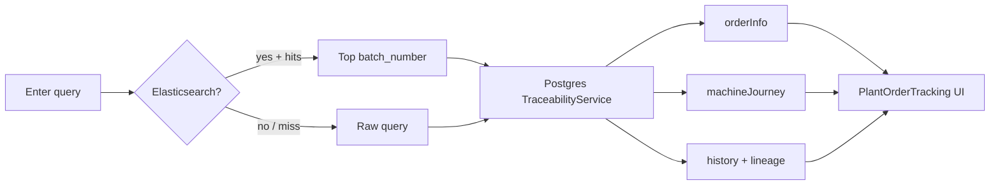

# Traceability Feature Reference

> **Purpose:** Document the **coil / order traceability** feature as implemented — for developers, plant engineers, and reuse on similar industrial MES projects.
>
> **Rule of truth:** Only what exists in code. Gaps are marked `PARTIALLY IMPLEMENTED` or `NOT IMPLEMENTED`.
>
> **Primary UI:** Search → Order info → Machine journey → Production history  
> **Primary API:** `GET /traceability?q=…`  
> **Related (separate):** thin `GET /reports/coil-traceability`, export type `COIL_TRACE` (backend yes; create-UI largely missing)

---

## Table of contents

1. [Feature overview](#1-feature-overview)
2. [Business purpose](#2-business-purpose)
3. [Who can use it (RBAC)](#3-who-can-use-it-rbac)
4. [User entry points](#4-user-entry-points)
5. [UX / screen layout](#5-ux--screen-layout)
6. [Search behaviour](#6-search-behaviour)
7. [What the results show](#7-what-the-results-show)
8. [Technical architecture](#8-technical-architecture)
9. [API reference](#9-api-reference)
10. [Data sources and joins](#10-data-sources-and-joins)
11. [Elasticsearch indexing](#11-elasticsearch-indexing)
12. [Reporting API (thin)](#12-reporting-api-thin)
13. [COIL_TRACE export](#13-coil_trace-export)
14. [End-to-end user journey](#14-end-to-end-user-journey)
15. [Implementation status](#15-implementation-status)
16. [Reuse on another plant project](#16-reuse-on-another-plant-project)
17. [Source index](#17-source-index)

---

## 1. Feature overview

Traceability answers:

> **Given a batch, coil, SAP order, or slit ID — what is this material’s plan identity, process journey, and production history across the plant?**

```text
User query (batch / coil / SAP / slit / BNDL-…)
        ↓
Optional Elasticsearch fuzzy match
        ↓
PostgreSQL resolve (ppc_batch + journey + coil lineage + prod_* rows)
        ↓
UI: Order Information + Machine Journey + Production History
```

It is a **desk search & inspect** feature (Plant Command Center / Machine Head). It is **not** an operator floor capture screen and **not** a PLC genealogy system.

---

## 2. Business purpose

| Need | How the feature helps |
|------|------------------------|
| Find an order quickly | Search by batch, coil, SAP order, slit |
| See planned identity | Customer, grade, machine, weight, plan date/shift |
| See multi-step route | Machine Journey from `order_journey_step` |
| See what actually ran | Production History from line capture tables |
| Follow parent coils | Lineage walk via `coil.coil.parent_coil_no` |
| CTL bundles | Query starting `BNDL-` resolves via CTL remarks |

**Generic industrial term:** Material / lot genealogy and process history lookup.

---

## 3. Who can use it (RBAC)

### Interactive search API + intended users

| Role | UI `/plant/orders` | UI `/machine-head/traceability` | API `/traceability` |
|------|--------------------|----------------------------------|---------------------|
| `ADMIN` | ✅ (rank) | ✅ | ✅ |
| `PLANT_HEAD` | ✅ | ✅ (rank) | ✅ |
| `MACHINE_HEAD` | ✅ | ✅ | ✅ |
| `SUPERVISOR` | ❌ (rank &lt; MH) | ✅ (`allow`) | ✅ |
| `QUALITY` | ✅ UI possible (rank) | ✅ rank | ❌ API denied |
| `OPERATOR` | ❌ | ❌ | ❌ |
| `PLANNER` | ❌ | ❌ | ❌ |

**Notes**

- Plant shell uses `PlantRoute` (`minRole=MACHINE_HEAD`), so QUALITY can open the page but search API calls return **403**.
- MH nav includes Traceability for most line capabilities; supervisors see nav id `traceability`.

### Related endpoints

| Endpoint | Roles |
|----------|-------|
| `GET /traceability/suggest` | Same as `/traceability` |
| `GET /reports/coil-traceability` | `PLANT_HEAD`, `MACHINE_HEAD`, `ADMIN` (**no SUPERVISOR**) |
| Export `COIL_TRACE` | Export authz (line READ); supervisors generally excluded from exports |

---

## 4. User entry points

| Entry | Route | Shell | Page title |
|-------|-------|-------|------------|
| Plant Command Center → Traceability | `/plant/orders` | `UnifiedShell` | Traceability |
| Machine Head → Traceability | `/machine-head/traceability` | `MachineHeadShell` (`standalone`) | Order Tracing |

**Component (shared):** `packages/client/src/pages/reports/PlantOrderTracking.tsx`

There is **no** separate `TraceabilityDashboard` page in the client (older docs may name one).

---

## 5. UX / screen layout

Desk chrome (200 px sidebar). Content max-width ~6xl, single column.

```text
┌─────────────────────────────────────────────────────────────┐
│ Traceability                                                │
│ Search by order, batch, coil, production number, …          │
│                                                             │
│ [🔍  Batch, coil, SAP order, slit ID…        ] [ Search ]   │
│      └─ Suggestions dropdown (if ES + ≥2 chars)             │
│                                                             │
│ ┌─ Order Information ─────────────────────────────────────┐ │
│ │ Identity · customer · grade · status · machine · …      │ │
│ └─────────────────────────────────────────────────────────┘ │
│                                                             │
│ ┌─ Machine Journey ───────────────────────────────────────┐ │
│ │ Step | Process | Machine | Status                       │ │
│ └─────────────────────────────────────────────────────────┘ │
│                                                             │
│ ┌─ Production History ────────────────────────────────────┐ │
│ │ Process badge · coil · field pairs · (PKL stoppage #)   │ │
│ └─────────────────────────────────────────────────────────┘ │
└─────────────────────────────────────────────────────────────┘
```

| UX detail | Behaviour |
|-----------|-----------|
| Suggest debounce | 300 ms |
| Suggest min length | 2 characters |
| Suggest without ES | Empty list (silent) |
| Typing after a result | Clears previous result |
| Click outside | Closes suggestions |
| Loading / error | Inline on page |
| Drawers / modals | **None** on this page |
| Export button | **None** on this page |

---

## 6. Search behaviour

### UI copy vs actual match keys

| UI marketing text | Actually matched (Postgres) |
|-------------------|-----------------------------|
| Order / batch / coil | ✅ `batch_number`, `coil_no` |
| SAP order | ✅ `sap_order_no` |
| Slit ID | ✅ `slit_id` |
| Production number / customer reference / material number | ❌ Not dedicated PG keys (ES fuzzy may hit customer/grade via `search_all` when ES is up) |

**Placeholder (accurate):** `Batch, coil, SAP order, slit ID…`

### Resolution modes

```text
q provided
  ├─ Elasticsearch available?
  │     YES → fuzzy multi-field search
  │            → top hit.batch_number
  │            → TraceabilityService.search(batch_number)
  │            → optional esMatches[0..5] (API only; UI ignores)
  │     NO / no hits → TraceabilityService.search(q)  // ILIKE exact-ish
  │
  └─ Coil tree always built from resolved coil (or raw q)
       ├─ BNDL-* → txn.prod_ctl.remarks ILIKE
       └─ parent_coil_no walk for lineage
```

Postgres match: `ILIKE` of the **full query string** against the four PPC fields (not substring tokenization in SQL).

### Autocomplete (`/traceability/suggest`)

| Requirement | Result |
|-------------|--------|
| ES up + q ≥ 2 | Suggestions from ES completion |
| Fields produced today | `type: 'batch' \| 'coil'` |
| Typed but unused | `sap_order`, `slit` in client type only |
| ES down | `[]` |

---

## 7. What the results show

### 7.1 Order Information (`orderInfo`)

Present when a `planning.ppc_batch` row is found.

| Field | Source |
|-------|--------|
| Batch / coil / slit / mother display | PPC (+ CRM order if linked); identity via `OrderIdentityDisplay` |
| Customer, grade | PPC |
| Status | CRM order status or `PENDING` |
| Sub-process, machine, allocated | PPC |
| Plan date, shift, weight MT | PPC |
| Target / input thickness | PPC |
| SAP order | PPC |

`motherCoil` in API is set to the same value as `coilNo` (display helper may still format identity).

### 7.2 Machine Journey (`machineJourney`)

From `planning.order_journey_step` for the batch’s `queue_batch_id`.

| Column shown | API field |
|--------------|-----------|
| Step | `step` |
| Process | `process` |
| Machine | `machine` |
| Status | `status` |

`completedAt` is returned by the API but **not rendered** in the table (`PARTIALLY IMPLEMENTED` in UI).

### 7.3 Production History (`history`)

Per-coil, multi-process capture rows walked from the target coil / lineage.

| Process key | Typical fields shown (`traceabilityFormat.ts`) |
|-------------|-----------------------------------------------|
| CRM6 / CRM | Sub-process, status, weights, mill, thickness |
| HRS | Grade, weight, slits, date, shift |
| PKL | Grade, weight, thickness, date (+ **stoppage count**) |
| ANN | Base, batch, charge, furnace, dew points, soak, stage, … |
| RWD / CRS / CTL | Weights, dates, CTL pieces/bundles/remarks, etc. |
| SKP | Thickness, weight, grade |

**Also**

- ANN: optional **Charge siblings** coil list  
- PKL: `stoppages` array → UI shows **count only**, not codes/times  
- Defects: **not** in interactive history (only in `COIL_TRACE` export)

Lineage array (`lineage: string[]`) is returned; UI focuses on history cards rather than a separate genealogy tree widget.

---

## 8. Technical architecture

```text
PlantOrderTracking (React)
        │
        ├─ GET /traceability/suggest?q=
        └─ GET /traceability?q=
                │
                ├─ ElasticTraceabilityService (optional)
                └─ TraceabilityService (Postgres truth)
                        ├─ planning.ppc_batch
                        ├─ txn.crm_order
                        ├─ planning.order_journey_step
                        ├─ coil.coil (parent walk)
                        └─ txn.prod_* / ann_charge* / crm_rolling|skinpass / stoppage (PKL)
```

| Layer | File |
|-------|------|
| UI | `PlantOrderTracking.tsx` |
| Client API | `lib/traceabilityService.ts` |
| Field labels | `lib/traceabilityFormat.ts` |
| Routes | `server/src/routes/traceabilityRoutes.ts` |
| Postgres resolve | `server/src/services/TraceabilityService.ts` |
| ES search | `server/src/services/ElasticTraceabilityService.ts` |
| Index defs / indexer | `elastic/traceabilityIndex.ts`, `traceabilityIndexer.ts` |
| Index trigger | PPC import (`PPCImportService` → `indexBulk` / `indexBatch`) |

Module guard: routes under M1 (`requireModule('M1', …)` in `app.ts`).

---

## 9. API reference

### `GET /traceability?q={query}`

**Auth:** `requireAuth` + role allow-list (PH / MH / SUPERVISOR / ADMIN)

| Status | Meaning |
|--------|---------|
| 200 | Trace payload |
| 400 | Missing `q` |
| 404 | `{ error: message }` when resolve throws (e.g. not found) |
| 403 | Wrong role |

**Response (conceptual)**

```ts
{
  query: string;           // from tree helper
  targetCoilNo: string;
  lineage: string[];
  history: {
    process: string;
    coilNo: string;
    record: Record<string, unknown>;
    stoppages?: unknown[];   // PKL
    siblings?: string[];     // ANN
  }[];
  orderInfo: { … } | null;
  machineJourney: {
    step: number;
    process: string;
    machine: string | null;
    status: string;
    completedAt?: string | null;
  }[];
  searchedBy: string;
  esMatches?: {              // only on ES hit path; UI unused
    batchNumber: string;
    coilNo: string;
    customer: string;
    grade: string;
    score: number;
  }[];
}
```

### `GET /traceability/suggest?q={query}`

| Condition | Body |
|-----------|------|
| q length &lt; 2 | `[]` |
| ES unavailable | `[]` |
| OK | `{ text, type, score }[]` |

---

## 10. Data sources and joins

### Order resolve

1. Match `planning.ppc_batch` on batch / coil / SAP / slit  
2. Optional `txn.crm_order` by `batch_id`  
3. Journey steps: `planning.order_journey_step` where `queue_batch_id = batch_id`

### Coil tree / history

1. Resolve target coil (or CTL bundle via `txn.prod_ctl.remarks`)  
2. Walk parents: `coil.coil.parent_coil_no`  
3. Collect production evidence per coil:

| Table(s) | Process label |
|----------|---------------|
| `txn.prod_hrs` | HRS |
| `txn.prod_pkl` (+ stoppages via `txn.stoppage` ⋈ `master.stoppage_code` on `shift_log_id`) | PKL |
| `txn.crm_order` ⋈ rolling / skinpass | CRM6 |
| `txn.ann_charge_coil` ⋈ `txn.ann_charge` | ANN |
| `txn.prod_rwd` | RWD |
| `txn.prod_crs` | CRS |
| `txn.prod_ctl` | CTL |

---

## 11. Elasticsearch indexing

| Topic | Implementation |
|-------|----------------|
| Documents | Primarily from `planning.ppc_batch` fields |
| When indexed | On PPC import (bulk/batch index helpers) |
| Full rebuild | `packages/server/scripts/reindex-traceability.mjs` |
| Startup | `ensureIndex` from server `index.ts` |
| Failure mode | Soft: log warning; search falls back to Postgres |

ES improves fuzzy / multi-field findability; **Postgres remains the system of record** for the full trace payload.

---

## 12. Reporting API (thin)

### `GET /reports/coil-traceability?coilNo=…`

| Item | Fact |
|------|------|
| Roles | PH, MH, ADMIN |
| Depth | Single coil master-ish row (grade, customer, process, status, weight) |
| Journey / history | **No** |
| Client UI | **NOT USED** — `reportingService.searchCoilTraceability` defined but no page calls it |
| Client typing | Typed as array; server returns `{ found, coilNo, genealogy }` object — mismatch |

Treat as a **legacy/thin reporting helper**, not the main Traceability feature.

---

## 13. COIL_TRACE export

| Item | Status |
|------|--------|
| Export type | `COIL_TRACE` — `IMPLEMENTED` server-side |
| Formats | XLSX, PDF (HTML binder path) |
| Content | Coil timeline of process runs + **defect labels** |
| Scope | Single `coil_no` **or** batch by customer + date range (see `coilTraceQuery.ts`) |
| Access | Line READ via `exportAuthz` / `assertCoilTraceAccess` |
| Plant UI create button | **NOT IMPLEMENTED** (DPR / Shift Summary / ANN charge report exist; COIL_TRACE create not wired) |
| Export history label | “Coil trace” appears in history filters |

Interactive Traceability page has **no** “Export this coil” action.

---

## 14. End-to-end user journey

```text
Login as Plant Head / Machine Head / Supervisor*
  → Open Traceability (Plant sidebar or MH nav)
  → Type batch / coil / SAP / slit (≥2 chars)
  → (Optional) pick suggestion
  → Search
  → Review Order Information
  → Review Machine Journey steps
  → Review Production History by process
  → (Optional) copy identifiers for shop-floor follow-up
```

\*Supervisor: MH route only for UI.



---

## 15. Implementation status

| Capability | Status | Notes |
|------------|--------|-------|
| Plant Traceability UI | `IMPLEMENTED` | `/plant/orders` |
| MH Traceability UI | `IMPLEMENTED` | `/machine-head/traceability` |
| Search API | `IMPLEMENTED` | `/traceability` |
| Autocomplete | `PARTIALLY IMPLEMENTED` | Needs ES; batch/coil only |
| ES fuzzy search | `PARTIALLY IMPLEMENTED` | Optional; soft fallback |
| Order info + journey + history | `IMPLEMENTED` | Single page |
| Journey `completedAt` in UI | `NOT IMPLEMENTED` | API has it |
| `esMatches` in UI | `NOT IMPLEMENTED` | API may return |
| Defects in interactive view | `NOT IMPLEMENTED` | Export only |
| Stoppage detail in UI | `PARTIALLY IMPLEMENTED` | PKL count only |
| Thin reports coil API | `PARTIALLY IMPLEMENTED` | No UI consumer |
| COIL_TRACE export engine | `IMPLEMENTED` | |
| COIL_TRACE create from UI | `NOT IMPLEMENTED` | |
| Operator access | `NOT IMPLEMENTED` | By design |

---

## 16. Reuse on another plant project

### Keep

1. **Search → Identity → Journey → History** three-panel pattern  
2. Plan row as order identity + journey steps as route + capture tables as evidence  
3. Optional search index with SQL as source of truth  
4. Desk-only RBAC (supervisor/area/plant), not operator kiosk  

### Map terms

| This product | Generic / steel example |
|--------------|-------------------------|
| Coil / batch / slit | Heat, slab, coil, lot, bundle |
| PPC batch | Production order / schedule line |
| Journey step | Route through shops |
| prod_* rows | Shop confirmation / mill certificate events |
| ANN charge | Furnace / batch heat cycle |

### Build checklist for a sibling MES

- [ ] One desk Traceability page (plant + area supervisor entry)  
- [ ] Search keys documented honestly (don’t overclaim UI copy)  
- [ ] Journey from route engine; history from shop capture tables  
- [ ] Optional ES/OpenSearch with SQL fallback  
- [ ] Export timeline (with defects) as a separate explicit action  
- [ ] Clear role matrix (who searches vs who exports)

---

## 17. Source index

| Concern | Path |
|---------|------|
| UI page | `packages/client/src/pages/reports/PlantOrderTracking.tsx` |
| Client service | `packages/client/src/lib/traceabilityService.ts` |
| History field map | `packages/client/src/lib/traceabilityFormat.ts` |
| Routes | `packages/server/src/routes/traceabilityRoutes.ts` |
| Postgres service | `packages/server/src/services/TraceabilityService.ts` |
| ES service | `packages/server/src/services/ElasticTraceabilityService.ts` |
| Index / indexer | `packages/server/src/elastic/traceabilityIndex.ts`, `traceabilityIndexer.ts` |
| Report thin API | `packages/server/src/routes/reportRoutes.ts` (`coil-traceability`) |
| Export | `packages/server/src/export/definitions/CoilTraceReport.ts`, `export/read/coilTraceQuery.ts` |
| Plant nav | `packages/client/src/components/layout/UnifiedShell.tsx` |
| MH nav capability | `packages/client/src/lib/mhLineCapabilities.ts` |
| App routes | `packages/client/src/App.tsx` |

---

*End of Traceability feature reference.*
